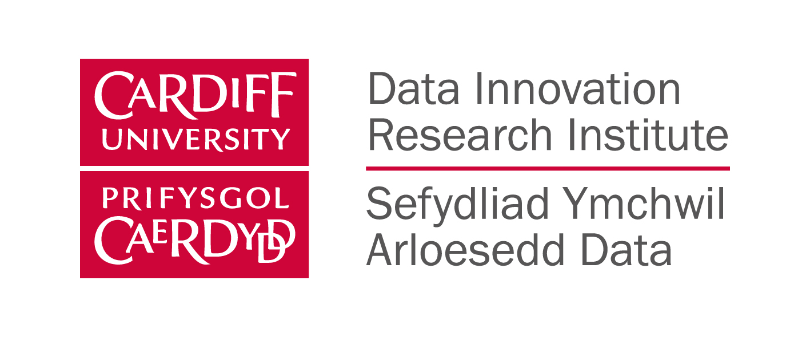
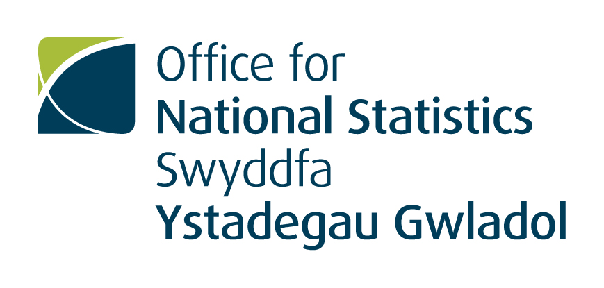

<a href="#register">Register</a> | <a href="#program">Program</a> | <a href="#logistics">Logistics</a>
 
# (Differentially) Private Synthetic Data Workshop 
Cardiff University, December 11th 2019,  [Bute Building S/2.32](https://www.google.co.uk/maps/dir//51.486654,-3.182173/@51.4867517,-3.1796604,17z)

## Call
We live in a society that is collecting data at an unprecedented level and very often this data is sensitive. Scientific studies often use confidential data. Government agencies hold data about citizens that are equally sensitive. And companies - think Facebook, Google or Twitter - are amassing data about consumer (online) behavior.

The original microdata can usually not be shared due to privacy concerns. Yet access for researchers to such data could potentially lead to new discoveries.  Statistical agencies might even be obliged to publish data without harming the privacy of individuals in the original collection.

One idea that recent research has increasingly focussed on is generating synthetic data. Ideally, synthetic microdata allows researchers to draw similar inferences as with the original data while protecting privacy. First promising research on synthesising microdata under strict privacy definitions - e.g. under differential privacy - has been published.

However, the debates often remain within their respective academic disciplines. This workshop intends to bring together leading researchers on privacy preserving synthetic data from computer sciences, statistics and applied backgrounds such as social sciences. Spotlighting recent advances in the respective disciplines, we especially seek to facilitate an interdisciplinary debate. Our goal is to share best practices and insights, identify joint challenges, and sketch the foundation for a joint roadmap.

Open questions include:
- How to measure disclosure risk with synthetic data?
- How to measure the utility of synthetic data for yet unknown analyses?
- How to account for the errors introduced by the privacy protection mechanism in subsequent analyses?
- What is an intuitive measure of privacy protection for applied researchers?

## Register
If you want to participate, please get in contact with [Chris Arnold](https://www.cardiff.ac.uk/people/view/994654-arnold-christian)

## Logistics
* Registration is open in entry hall of Bute building from 9am.
* The workshop starts at 10am and ends at 6pm.
* Every presentation can take up to 15 mins.
* Each block consists of a set of presentations and 30 mins joint discussions/questions.
* After each block, there is a 45 mins break to chat and have a coffee/tea/sandwich in an informal setting.
* The last hour is an open space format to enable further collaborations.
* For those who want to continue, we will have dinner at [Valentino's](https://www.valentinocardiff.com/) at 7pm. Please confirm your participation with [Chris](mailto:arnoldc6@cardiff.ac.uk) until December 5th.
* We will provide you with a quick 4 item questionnaire after the workshop. Chris and George will use it to collect joint learnings, edit responses and feed everything back.

## Programme

### Welcome Notes *(10am&mdash;10.15am)*

*Christian Arnold (Cardiff University)*

*Irena Spasić (Cardiff University)*

### 1 Private Synthetic Data in Practice *(10.15am&mdash;11.45am)*

#### 1.1 Synthetic Data As a Regulatory Enabler
*Pavle Avramovic (Financial Conduct Authority)*

#### 1.2 Increasing Access to Data While Maintaining Trust
*Fionntán O'Donnell (Open Data Institute)*

#### 1.3 Towards a Future Where Privacy Enables Innovation
*Pierre-Andre Maugis (Privitar)*

#### 1.4 Synthetic Data in the Office for National Statistics: Research, Challenges and Applications
*Ioannis Kaloskampis (Office for National Statistics)*

### 2 Promises and Pitfalls of Private Synthetic Information *(12.30pm&mdash;2pm)*

#### 2.1 Differential Privacy for Government Agencies&mdash;Some Things to Consider
*Jörg Drechsler (Institute for Employment Research, Germany)*

#### 2.2 Really Useful Synthetic Data&mdash;Promises and Challenges of Releasing Sensitive Information With Differentially Private Data Synthesizers
*Christian Arnold (Cardiff University), Marcel Neunhoeffer (University of Mannheim) and Sebastian Sternberg (University of Mannheim)*

#### 2.3 Is It Safe to Leave &epsilon;-Differentially Private Data On A Train?
*Gillian Raab (University of Edinburgh)*

#### 2.4 When the Signal Is in the Noise: A Noise-Exploitation Attack on Diffix
*Florimond Houssiau (Imperial College London)*

### 3 New Ways of Advancing Data Privacy and Utility *(2.45pm&mdash;4.30pm)*

#### 3.1 Integrating Differential Privacy in the Statistical Disclosure Control Tool-kit for Synthetic Data Production
*Natalie Shlomo (University of Manchester)*

#### 3.2 Multiplicative Weights Post-Amplification of Differentially Private GANs
*Cynthia Dwork (Microsoft Research), Marcel Neunhoeffer (University of Mannheim) and Zhiwei Steven Wu (University of Minnesota)*

#### 3.3 Differentially Private Mixture of Generative Neural Networks
*Emiliano De Cristofaro (University College London)*

#### 3.4 The Trade-off between Information Utility and Disclosure Risk in a GA Synthetic Data Generator
*Mark Elliot (University of Manchester)*

#### 3.5 Protecting String Data from Reconstruction
*Grigorios Loukides (Kings College London)*

### 4 Joint Discussion: Further Pathways (5pm&mdash;6pm)

#### Report from the Protecting Citizens Online Funding Workshop, UKRI
*George Theodorakopoulos (Cardiff University)*

#### Open Space

## Organising Team 
- Christian Arnold (Cardiff University)
- Marcel Neunhoeffer (University of Mannheim)
- Gentiana Roarson (Office for National Statistics)
- George Theodorakopoulos (Cardiff University)

